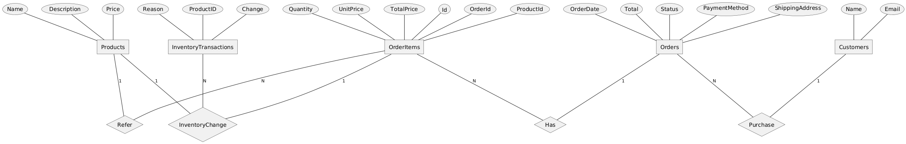

# Part 1: MongoDB Schema Design

> Author: Lam Le  
> Email: nguyenlam1997@gmail.com  

Generally, when I work on a new database design, this is the common process:

1. Define application. Identify common use cases and workloads.
2. Analysing application's data, then define entities and identify their relationships.
3. Choose a database technology. Design physical database schemas.
4. Consider other features of each database engine, such as: Indexing, Schema validation, Procedures, Constraints, Replica sets, Sharding, so on.

With this process in mind, my answer document (this file) will follow the structure above.

## 1. Define application, common use cases, workloads

Application is an eCommece platform.  
Common data we work with: product info, customer data, orders, inventory tracking data.  
Actors / Types of users with the platform: Customers, Back-office administrators.  

Common use cases and their anticipated workloads:

| Action | Operation type | Data | Frequency | Priority |
| --- | --- | --- | --- | --- |
| Customers view product listing pages | Read | Product titles, prices, brief descriptions, thumbnails | High | High |
| Customers view product detail pages | Read | A detailed product infomation, images, reviews | High | High |
| Customer places an order | Write | Product ID, bought quantities, delivery data | Medium | High
| Customer reviews status of their order | Read | Order, delivery information | Low - Med | Medium
| Customer submtis a review on a product | Write | Customer, Comment text | Low | Medium
| Back-office admin submits new products | Write | Product details | Low - Med | Medium

## 2. Define entities and their relationships



The platform needs the following entities:
- Products: store detailed product information
- Customers: hold customer data
- Orders: store order data
- Order items: store details of orders
- Inventory transactions: store all changes made against the stock (restock or sell)

Their relationships can be seen as following:
- One customer can place multiple orders. But an order belongs to one customer only.
- An order has at least 1 or multiple items. An item belongs to one order.
- An order item refers to 1 product. But a product can be sold zero or multiple times, describing through order items.
- An inventory transaction tells the change of a product, made by an order item (or a restock action)

## 3. Design database schemas

### Products collection

Fields:
- _id
- name: Product name
- description: Full description of the product
- shortDescription: short description of the product, SEO-friendly preview description
- thumbnails: An array of URIs to thumbnail images
- images: An array of URIs to detail product images
- price: Unit price
- currency
- categories: an array of product categories
- tags: An array of keywords (for filters, full-text search, SEO)
- inventoryCount: Using the computed pattern, we store the stock count directly, so that we do not have to compute every time (calculating through inventory transaction collection)
- reviews: embedded doc for reviews of other customers about this product. May apply subset pettern to only include most recent reviews in Productions collection. Old reviews are stored in a separate Reviews collection.
- rating: average rating pre-computed from all individual consumer reviews
- createdAt: Date when product is first added
- lastUpdatedAt: timestamp, concurrency control

Schema validation rules:
- "price", "inventoryCount" must be larger or equal to 0
- "rating" must be in an acceptable range (0 to 5)

Sample JSON:

```json
{
  "_id": {
    "$oid": "682c2d6a6f53531eb0d4ca99"
  },
  "name": "UltimateHome 700 Lightweight handstick vacuum cleaner",
  "description": "Lightweight, ergonomic design: With an ergonomic form and weighing approximately 1.9kg*, this lightweight vacuum is designed for you to clean large areas with effortless comfort. With its compact size, it is ideal for cleaning small spaces with ease.",
  "shortDescription": "Lightweight vacuum at approximately 1.9kg*. Triple the suction power* for thorough cleaning. 35% smaller* nozzle to reach tighter spots.",
  "thumbnails": [
    "https://www.electrolux.vn/globalassets/importimageproduct/18-en-new/efp71512--img-en.jpg"
  ],
  "images": [
    "https://www.electrolux.vn/globalassets/appliances/vacuum/efp71512/efp71512-angr-1500x1500.png?width=464",
    "https://www.electrolux.vn/globalassets/appliances/vacuum/efp71512/efp71512-cp-1500x1500.png?width=464",
    "https://www.electrolux.vn/globalassets/appliances/vacuum/efp71512/efp71512-han-1500x1500.png?width=464"
  ],
  "categories": [
    "Vacuum cleaners"
  ],
  "tags": [
    "vacuum",
    "new",
    "sale",
    "design-award-2023"
  ],
  "price": 7490000,
  "currency": "VND",
  "inventoryCount": 500,
  "reviews": [
    {
        "reviewId": 1,
        "reviewAuthor": "Giuseppe",
        "stars": 5,
        "reviewText": "Awesome product. A must-buy",
        "createdAt": {
            "$date": "1999-12-31T17:00:00.000Z"
        }
    }
  ],
  "rating": 5,
  "createdAt": {
    "$date": "1999-12-31T17:00:00.000Z"
  },
  "lastUpdatedAt": {
    "$timestamp": {
      "t": 1747726174,
      "i": 1
    }
  }
}
```

### Product catalog collection

While the main "products" collection stores all detailed productd data, we may need a separate product catalog collection to store pre-processed / precomputed facets and search attributes. These information help us improve the performance of product listing pages.

The tradeoff is data duplication, but, we can maintain a separate lean collection for quick listing page displays. Product details collection may grow over time to support the complexity of product detail page, but this collection should be lean, and fast.


```json
{
  "_id": {
    "$oid": "682c2d6a6f53531eb0d4ca99"
  },
  "name": "UltimateHome 700 Lightweight handstick vacuum cleaner",
  "shortDescription": "Lightweight vacuum at approximately 1.9kg*. Triple the suction power* for thorough cleaning. 35% smaller* nozzle to reach tighter spots.",
  "thumbnails": [
    "https://www.electrolux.vn/globalassets/importimageproduct/18-en-new/efp71512--img-en.jpg"
  ],
  "categories": [
    "Vacuum cleaners"
  ],
  "tags": [
    "vacuum",
    "new",
    "sale",
    "design-award-2023"
  ],
  "price": 7490000,
  "currency": "VND",
  "inventoryCount": 500,
  "reviewCount": 1,
  "rating": 5,
  "createdAt": {
    "$date": "1999-12-31T17:00:00.000Z"
  },
  "lastUpdatedAt": {
    "$timestamp": {
      "t": 1747726174,
      "i": 1
    }
  }
}
```

Consider adding these indexes:
- Single field index for "name"
- Compound index for "categories", "price", "inventoryCount", "rating"

### Customers collection

Fields:
- _id
- firstName
- lastName
- email: Unique email, enforce by creating unique single-field index
- password: hashed password
- phone: contact number
- addresses: subdocuments for customer's addresses.
- createdAt: date
- lastUpdatedAt: timestamp, concurrency control

Sample:

```json
{
  "_id": {
    "$oid": "333c47c46f53531eb0d4caa2"
  },
  "firstName": "Lam",
  "lastName": "Le",
  "email": "lam.le@email.com",
  "password": "myhashedpassword",
  "phone": "+84964440485",
  "addresses": [
    {
      "addressLine1": "line 1",
      "addressLine2": "line 2",
      "city": "Can Tho City",
      "country": "Viet Nam"
    }
  ],
  "createdAt": {
    "$date": "1999-12-31T17:00:00.000Z"
  },
  "lastUpdatedAt": {
    "$timestamp": {
      "t": 1747726174,
      "i": 1
    }
  }
}
```

### Orders collection

Fields:
- _id
- customerId: Reference to the customer Id who placed this order
- shippingAddress: extended reference to the chosen shipping address of the customer. Embed directly customer name, phone, address lines, city, country here so it's easier to query later, without joins. Plus, customers may update or add more addresses after placing an order. It's better to have all info here as a reference version.
- orderItems: Array of subdocuments:
  - productId
  - productName
  - quantity
  - unitPrice
  - totalPrice
- subTotal
- shippingCost
- tax
- total
- status
- createdAt
- lastUpdatedAt

Sample

```json
{
  "_id": {
    "$oid": "111c47c46f53531eb0d4caa2"
  },
  "customerId": {
    "$oid": "444c47c46f53531eb0d4caa2"
  },
  "orderItems": [
    {
      "productId": "kb123456789",
      "productName": "Amazing Keyboard",
      "quantity": 2,
      "unitPrice": 100000,
      "totalPrice": 200000
    }
  ],
  "subtotal": 200000,
  "tax": 20000,
  "shipping_cost": 30000,
  "total": 250000,
  "shipping_address": {
    "customerName": "Lam Le",
    "addressLine1": "line 1",
    "addressLine2": "line 2",
    "city": "Can Tho",
    "country": "Viet Nam"
  },
  "status": "Delivering",
  "createdAt": {
    "$date": "1999-12-31T17:00:00.000Z"
  },
  "lastUpdatedAt": {
    "$timestamp": {
      "t": 1747726174,
      "i": 1
    }
  }
}
```

### Inventory transactions collection

Fields:
- _id
- productId
- change
- reason
- createdAt
- lastUpdatedAt

Sample:

```json
[
  {
    "_id": {
      "$oid": "123c47c46f53531eb0d4caa2"
    },
    "productId": {
      "$oid": "444c47c46f53531eb0d4caa2"
    },
    "change": -2,
    "reason": "Order 111c47c46f53531eb0d4caa2",
    "timestamp": "2025-05-21T12:35:00Z"
  },
    {
    "_id": {
      "$oid": "144c47c46f53531eb0d4caa2"
    },
    "productId": {
      "$oid": "444c47c46f53531eb0d4caa2"
    },
    "change": 200,
    "reason": "Restock",
    "timestamp": "2025-05-21T12:35:00Z"
  },
]
```