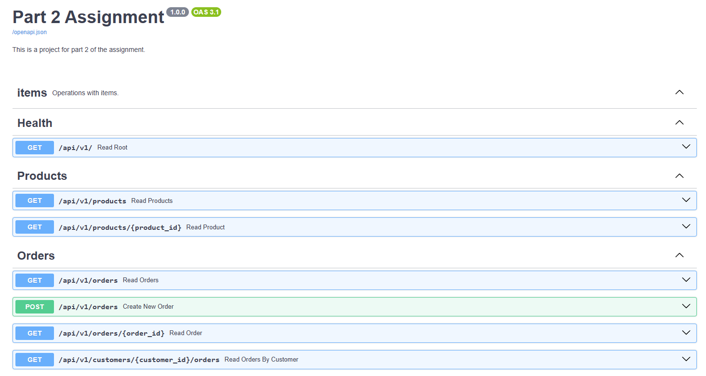

# Part 2: FastAPI Implementation

## Getting Started

Create venv and install packages. I'm using `uv`, but you can use `pip`

```
uv venv
.\.venv\Scripts\activate
uv pip install -r pyproject.toml
```

You would need a local MongoDB server, adjust configs in `.env` file (see `app/core/config.py`). Then, run the following command to start a local development server

```
fastapi dev app/main.py
```

To run tests

```
pytest
```

## Project overview

The following endpoints are implemented:
- 


Some details about project structure:
- app/api: Where routes and endpoints are defined
- app/core: Business-tier services and endpoint models (commands, queries - as in CQRS)
- app/repositry: Repositories that interact with the database
- app/models: MongoDB models
- tests: Unit tests