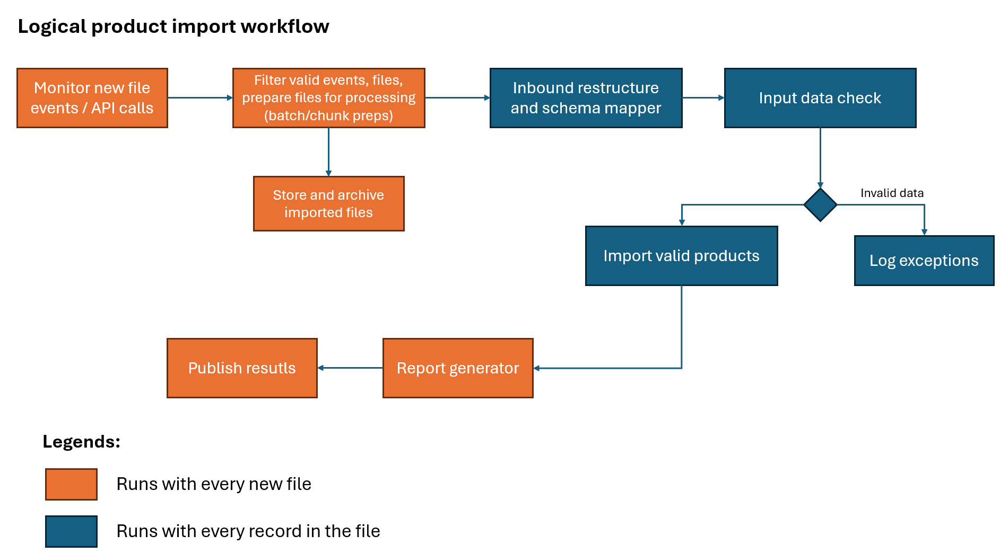
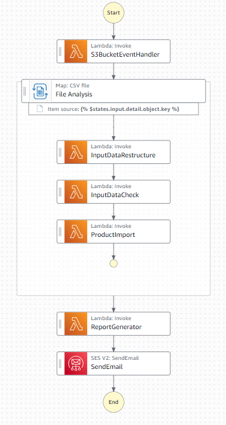

# Part 3: AWS Architecture

## Logical workflow

The diagram above is the overall logical product import workflow.

When a new file is imported, a monitoring process would publish an event.

We would have an event handler subscribing to that event. It would perform preliminary checks about event types, file types and other business constraints. Usually, an imported file would be broken down into smaller batches or chunks for parallel processing. In case of an CSV file, it's usually by dividing the file by rows/lines.

On the other hand, we would also need to store and archive the newly imported file to an archive blob/bucket storage.

Next steps can be run at individual record level, or by batch/chunk.

First, we perform inbound restructure (cleansing, structuring, standardisation) and schema mapper. The input data would be restructured and reflected into our internal schema.

Next, iterating through newly mapped records, we perform input data check (usually, on the business domain).

If any record fails to meet the requirements of the validators in input data check step, we raise and log them as exceptions. We can flag them and put messages to a queue/database or raise events for another process to handle these.

Valid items would move to the Impor valid products step. 

Finally, after all items, batches of the file are processed and imported, we run the report generator component, and then publish results (sending emails, notifications, etc.)

## Workflow implemented on AWS

The proposed workflow that is implemented with AWS Step Function is as following:

Due to time constraints, I did not go into full implementation and have a fully functional flow. However, I will go over the primary steps below.

The prerequisites are:
- A S3 bucket where new CSV files are uploaded to
- Lambda functions for each step
- A target MongoDB

After creating S3 bucket, we may enable its ability to send events with Amazon EventBridge. All events from S3 will be sent to EventBridge. By default, EventBridge would help us with retries and dead-letter queues for failure cases.

At EventBridge, we can create suitable rules to further route our events. In our current case, we can create a rule for Object Created in `aws.s3` resource, and set our state machine as target, using event bus.

The steps/components from the logical workflow would be laid out in Step Function's state machine flow.

We can use the built-in Distributed Map to process CSV file in S3. It offers a high-concurrency process (up to 10000 child workflows at the same time). It helps us handle large files quite well.

## Error handlers and retries

We can configure retriers on each Lambda task. It should catch transient service errors and 429 TooManyRequest errors. Add jitter and backoff strategies to the retry logic.

On Lambda-function-level, we should catch and log known exceptions to avoid uncaught exceptions during runtime.

Additionally, we may use DynamoDB, Redis, or SQS/queue to log failed products and failed executions. Then, we create a different state machine flow to handle these failure cases, to see whether we can retry them or not, or ultimately failed. In case those items can be retried, then we can start the execution of the main state machine flow again by aggregating them into a new CSV file.

## Samples

## Input Data Restructure and Schema Mapper component

The sample is provided in `2-inputDataRestructure` folder.

It takes raw product data, performs cleansing, structuring, standardising and produces good data for next steps. It also mocks and external HTTP request, where unknown exceptions can happen. We need to throw raise correct exceptions so that the Step Function task can catch and retry.

### Input Data Check component

The sample Input Data Check function is provided in `3-inputDataCheck` folder.

It takes mapped product data (produced by the previous step, Input Data Structure), and performs validations on it. Validation logics are divided into individual validators. It sets clear boundaries of each unit and what they suppose to check and validate.

For example, I have two validators: Illegal product validator (filter out prohibited products) and Price threshold validator (filter products with price range).