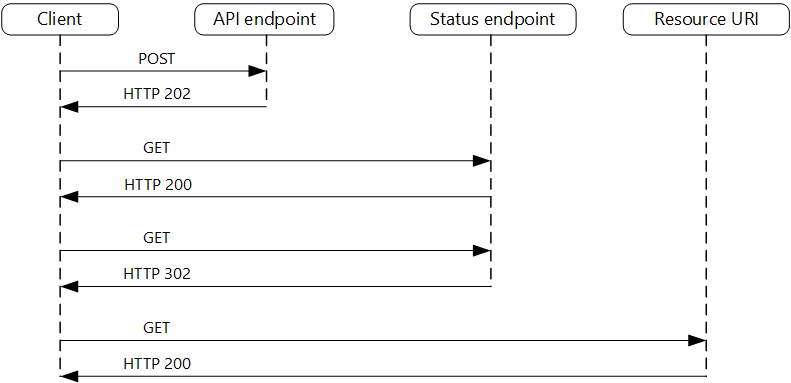

# Part 4: Problem-Solving Challenge

## Getting Started

Create venv and install packages. I'm using `uv`, but you can use `pip`

```
uv venv
.\.venv\Scripts\activate
uv pip install -r pyproject.toml
```

You would need a local MongoDB server, adjust configs in `.env` file (see `app/core/config.py`). Then, run the following command to start a local development server

```
fastapi dev app/main.py
```

To run tests

```
pytest
```

## Potential bottlenecks and inefficiencies and solutions

### 1. Product search endpoint is slow

The current endpoint's pagination uses the traditional skip-limit with `find()` method. For small page numbers, this may be acceptable. However, if we have a large collection, that can be a performance bottleneck.

Another potential cause is missing indexes.

**The solution:**

For pagination in MongoDB, we can use its aggregation framework. I'm not well-versed in MongoDB, but after a few quick reads, aggregation is meant to be more powerful and better in performance. In worse-case senario, aggregation pipeline is "translated back" to `find()`.

I have pasted the sample code to this project and adjusted it to use aggregation. The file is `app/api/endpoints/sample_products.py`. The pipeline is simply `$match | $sort | $facet`. I also convert the API endpoint to support queryParams page and page size instead. I feel these are more understandable, human-friendly than skip-limit.

For quick reference, here it is:

```python
async def get_products(
    page: int = Query(1, alias="pagination[page]", ge=1),
    page_size: int = Query(10, alias="pagination[pageSize]", ge=1),
    category: Optional[str] = None,
):
    query = {}
    if category:
        query["category"] = category

    pipeline = [
        {
            "$match": {
                "category": {
                    "$regex": category if category else "",
                    "$options": "i"
                }
            } if category else {}
        },
        {
            "$sort": {
                "name": 1
            }
        },
        {
            "$facet": {
                "metadata": [
                    {"$count": "totalCount"}
                ],
                "data": [
                    {"$skip": (page - 1) * page_size},
                    {"$limit": page_size}
                ]
            }
        }
    ]

    async with MongoDBConnection.get_collection(
        "ecommercedb", "products"
    ) as collection:
        cursor = collection.aggregate(pipeline)
        agg_result = await cursor.to_list(length=None)
        if agg_result:
            metadata = agg_result[0].get("metadata", [])
            products = agg_result[0].get("data", [])
            total = metadata[0]["totalCount"] if metadata else 0
        else:
            products = []
            total = 0
        # Some quick workarounds to work with data types. Should be unrelated to the assignment
        for product in products:
            product["_id"] = str(product["_id"])
            product["lastUpdatedAt"] = None

    return {
        "meta": {
            "pagination": {
                "page": page,
                "pageSize": page_size,
                "total": total,
                "pageCount": (total + page_size - 1) // page_size if page_size else 0
            }
        },
        "products": products
        }
```

Secondly, we can consider adding compound indexes to the fields used in filters and sorting, such as `category`, `name`, etc. 


### 2. Order processing sometimes fails under high load

I can't see any sample code for creating a new order, but I think my current implementation of POST /order would fails under high load. 

If the endpoint implementation is synchronous, under high load, the endpoint may get overloaded. MongoDB can also get overloaded and exhausted by the number of connections and constant loads. This would cause MongoDB operations to timeout.

Abou the solution, usually, we have two options: scale out and scale up. By scaling out, we can increase the numbers of API servers / function instances / containers. By up, we can increase the specs of the platforms.

Another solution is to decouple the POST /order endpoint with the actual order processing logic behind. We implement asynchronous request-reply pattern. 

I borrow the flow diagram from [Microsoft Learning](https://learn.microsoft.com/en-us/azure/architecture/patterns/async-request-reply) about this pattern below:



Typically, our POST /order endpoint would return HTTP 202 Accepted almost instantly, signaling that the server has received the request and will start the asynchronous process soon enough. But since it returns almost right away, the frontend apps do not hang. The loads will be significantly lower as well.

The asynchronous process can be started by the endpoint with a message queue or an event bus. Detached event handlers would monitor and start processing when they receive the messages.

We also support a status endpoint so that the frontend apps can poll to get the processing status. Once everything is finished (successfully or not), we have another endpoint to query the result.

## Monitor

For local database debugging, I suggest benchmarking queries with a database profile against different datasets (small, and large ones). This can help us understand performance on the database level.

For monitoring live platforms, typically, I would suggest:
- Prometheus, (Grafana): for general metrics monitoring, alerts
- ELK for log and exception aggregation
- Jaeger for distributed tracing

Depending how we physically deploy our services, we have corresponding ways to set up monitoring.

For example, we can set up MongoDB exporter to let Prometheus scrape its metrics.

If we deploy our API endpoints as AWS Lambda functions, we can use Lambda Telemetry API and Lambda Extensions. Captured logs and metrics would be pushed from Lambda extension into Prometheus PushGateway. In turn, Prometheus would poll the pushgateway to get metrics.

Once we have monitoring setup in place, we can keep track of how our platform performs.

To ensure performance fixes are efficient, we can run load tests, performance test before and after the fixes. The metrics would help us understand the root causes, and the efficiency of the fixes.