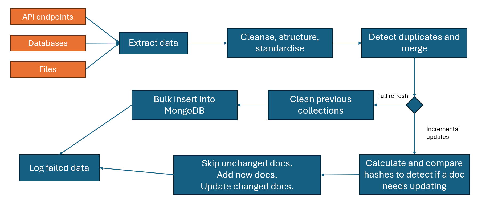

# Part 5: Learning & Adaptability

## Overall

Overall workflow diagram of the ETL pipeline:



- Extract data
- Transform (cleanse, structure, standardise)
- Detect duplicates and merge
- In case of full refresh:
  - Clean previous collections and then bulk insert everything into the database
- In case of incremental updates:
  - Calculate and compare hashes to detect if a doc needs updating
  - Skip unchanged docs. Add new docs. Update changed docs.
- Log failed data
  
To detect and merge duplicated product records, I use [Dask](https://www.dask.org/) for parallel processing with MapReduce pattern:
```python
# dedup_key is (record["name"], record["category"])
# merge_records hold the logic to perform merges

bag = db.from_sequence(records, npartitions=4)
# foldby groups records by the deduplication key and applies the merge function.
deduped = bag.foldby(
    key=dedup_key,
    binop=merge_records,
    initial=None 
).map(lambda t: t[1])
return deduped.compute()
```

To optimize memory usage, opting for Dask is also valuable. It performs well on multi-core CPUs and streams data efficiently from disk. It can run on distributed cluster. Another approach is to use generators (aka `yield`) in extract and transform steps. 

## The ETL sample

The sample ETL pipeline is defined at `main.py` file, illustrating the key points disscused above.

A target MongoDB is a prerequisite. Data sources are mocked within the folder and in-memory.

To start a full refresh:

```
pip install -r requirements.txt
.\main.py --full-refresh
```

or, incremental updates:

```
pip install -r requirements.txt
.\main.py
```

### Data quality issues

Data quality is handled in `transform(record)` and `merge_records(acc, record)` functions. For example, we can decide what to do with extra fields, or alternative versions of the same fields. During duplicate merges, we can decide which version of duplicates to side with.

In the code, for example, I populate `subcategory` for all product records, and choose the duplicated version with lower price.

### Processing failures

In `transform(record)`, when there is an error among the transformation steps, the whole function returns None. Combining with the generator from the extract step, each product record fails on its own. In other words, one product fails, the others continue with the pipeline.

In the same manner, I also apply the same pattern to extract steps. 
The `safe_extract` helper function yields the record from each extraction generator. If an error happens, I log it and simply yield nothing from the source.  
When I chain them together in `extract_all`, a failure from one source won't stop the pipeline and stop the extraction of othe sources.

Generally, we should aggregate failed cases to a single place. But I have not done so in the sample, simply log them out.

### Incremental updates and full refreshes

In my understanding, full refreshes mean to remove all existing collections and start from scratch. That's it. So I simply remove everything before bulk insert the records into the database again.

For incremental updates, logically, I think we need to calculate hashes (and/or bitmasks) for change detection of each product record. If the record is entirely new (by checking the key), then we just need to insert it. If an existing record has content changes, or has new fields in the data sources, then we perform update action. We skip unchanged records.

I have not implemented the logic above, but I suspect it would fit into `is_equal(existing_doc, record)` function, which is used by `load_to_mongodb` function.